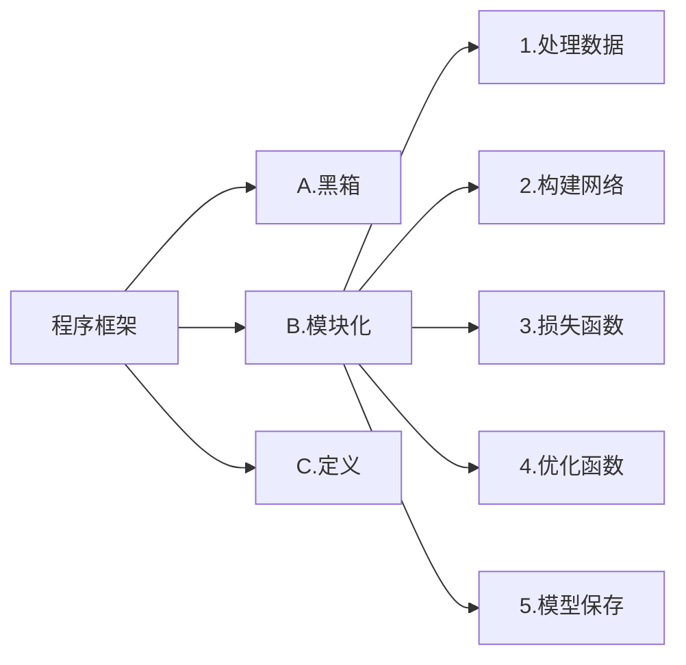

记录深度学习基本概念，不断更新中，项目地址：[DLpractice](https://github.com/Arrowes/DLpractice)
<!--more-->

从机器学习到深度学习：[从机器学习谈起](https://www.cnblogs.com/subconscious/p/4107357.html)，[从神经元到深度学习](https://www.cnblogs.com/subconscious/p/5058741.html)
什么是卷积讲解视频：[大白话讲解卷积神经网络工作原理](https://www.bilibili.com/video/BV1sb411P7pQ/?share_source=copy_web&vd_source=b148fb6f311bfe6f3870ad8f4dfda92a)

[DL500问](https://github.com/scutan90/DeepLearning-500-questions)

# 深度学习框架



GPU 网络和数据要同时送进GPU

## 激活函数 Activate Function
激活函数是深度学习神经网络中的一个重要组成部分，它用来引入*非线性性质*，使神经网络能够学习复杂的函数关系。激活函数接收神经元的输入，并产生输出作为下一层神经元的输入。在神经网络中，激活函数通常被应用于每个神经元的输出，使神经网络能够进行非线性映射和学习。

激活函数的主要作用有以下几点：
+ 非线性映射：激活函数引入非线性性质，使神经网络可以逼近和表示复杂的非线性函数。如果没有激活函数，多层神经网络的组合将等效于单一层的线性变换。
+ 特征提取：激活函数有助于神经网络从输入数据中提取关键特征，例如边缘、纹理、形状等，以便更好地完成分类、回归和其他任务。
+ 解决梯度消失问题：某些激活函数（如ReLU）有助于减轻梯度消失问题，使深层网络能够更好地进行反向传播和训练。

一些常见的激活函数包括：

激活函数                       |特点          |图像
------------------------------|--------------|---------
 $$softmax(x_i) = \frac{e^{x_i}}{\sum_{j=0}^{N} e^{x_j}}$$  | 将未规范化的预测变换为非负数并且总和为1，同时让模型保持可导的性质;常用在分类网络的最后一层，把网络输出转化为各类别的概率。 |首先对每个未规范化的预测求幂，这样可以确保输出非负。为了确保最终输出的概率值总和为1，再让每个求幂后的结果除以它们的总和
挤压函数（squashing function）$$sigmoid(x) = \frac 1{1 + exp(−x)}$$  | 将输入映射到范围(0, 1)，常用于二元分类问题。sigmoid可以视为softmax的特例 | 
双曲正切 $$tanh(x) = \frac {1 − exp(−2x)}{1 + exp(−2x)}$$   |   将输入映射到范围(-1, 1)，也用于某些分类和回归问题, 当输入在0附近时，tanh函数接近线性变换。形状类似于sigmoid函数，不同的是tanh函数关于坐标系原点中心对称。（LSTM）|
修正线性单元（Rectified Linear Unit）$$ReLU(x) = max(x, 0)$$  $$LeakyReLU=max(αx,x)$$ |求导表现得特别好：要么让参数消失，要么让参数通过。最常用的激活函数，通常能够加速收敛和减轻梯度消失问题（Transfromer）； LeakyReLU中通常设α=0.01来调整负值的零梯度，缓解dead ReLU问题（YOLO） 若α为可学习参数，则为PReLU|    
指数线性单元 (Exponential Linear Units) |   对小于零的情况采用类似指数计算的方式进行输出。与 ReLU 相比，ELU 有负值，这会使激活的平均值接近零。均值激活接近于零可以使学习更快，因为它们使梯度更接近自然梯度。但计算量较大 |


## 感受野(Receptive field)
感受野是指在卷积神经网络中，输出特征图上的一个像素点对应于输入图像上的感受区域大小。感受野的大小可以用来衡量网络在某一层上能够“看到”输入图像的范围，从而影响网络对局部和全局信息的感知能力。


$   n_{output.features}=[\frac{n_{input.features}+2p_{adding.size}-k_{ernel.size}}{s_{tride.size}}+1]   $
较小的感受野通常用于捕获局部特征，而较大的感受野则有助于捕获全局信息。


## 卷积
  


## 反向传播
待续

## Optimizer


$$SGD → SGDM → NAG → AdaGrad → AdaDelta → Adam → Nadam$$
  


## Batch size
batch size的大小影响的是训练过程中的完成*每个epoch所需的时间* $^1$（假设算力确定了）和每次迭代(iteration)之间*梯度的平滑程度* $^2$。
> 1. 假设训练集大小为N，每个epoch中mini-batch大小为b，那么完成每个epoch所需的迭代次数为 N/b , 因此完成每个epoch所需的时间会随着迭代次数的增加而增加
2. 如pytorch\tensorflow等深度学习框架，在进行mini-batch的loss反向传播时，一般都是先将每个mini-batch中每个样本得到的loss求sum后再平均化之后再反求梯度，进行迭代，因此b的大小决定了相邻迭代batch之间的梯度平滑程度。一个batch内所含样本越多，这个batch的梯度应该越能反映真实的梯度，因此这样的大batch间梯度不会跨越太大

因此：大的batch_size往往建议可以相应取大点learning_rate, 因为梯度震荡小，大 learning_rate可以加速收敛过程，也可以防止陷入到局部最小值，而小batch_size用小learning_rate迭代，防止错过最优点，一直上下震荡没法收敛 
>1. 若是loss还能降，指标还在升，那说明欠拟合，还没收敛，应该继续train，增大epoch。
2. 若是loss还能再降，指标也在降，说明过拟合了，那就得采用提前终止（减少epoch）或采用weight_decay等防过拟合措施。
3. 若是设置epoch=16，到第8个epoch，loss也不降了，指标也不动了，说明8个epoch就够了，剩下的白算了。

## 损失函数「loss function」
来度量模型的预测值$\hat{y}$与真实值$y$的差异程度的运算函数，它是一个非负实值函数，通常使用$L(y, \hat{y})$来表示，损失函数越小，模型的鲁棒性就越好。
### 基于距离度量的损失函数
基于距离度量的损失函数通常将输入数据映射到基于距离度量的特征空间上，如欧氏空间、汉明空间等，将映射后的样本看作空间上的点，采用合适的损失函数度量特征空间上样本真实值和模型预测值之间的距离。特征空间上两个点的距离越小，模型的预测性能越好。
**L1范数损失函数（MAE）**
$$L_{MSE}=\frac{1}{n}\sum_{i=1}^{n}|y_i-\hat{y_i}|$$
又称为曼哈顿距离，表示残差的绝对值之和。L1损失函数对离群点有很好的鲁棒性，但它在残差为零处却不可导,且更新的梯度始终相同；
**L2损失函数（MSE均方误差损失函数）**
$$L_{MSE}=\frac{1}{n}\sum_{i=1}^{n}(y_i-\hat{y_i})^2$$
在回归问题中，均方误差损失函数用于度量样本点到回归曲线的距离，通过最小化平方损失使样本点可以更好地拟合回归曲线。（L2损失又被称为欧氏距离，是一种常用的距离度量方法，通常用于度量数据点之间的相似度。）
### 基于概率分布度量的损失函数
基于概率分布度量的损失函数是将样本间的相似性转化为随机事件出现的可能性，即通过度量样本的真实分布与它估计的分布之间的距离，判断两者的相似度，一般用于涉及概率分布或预测类别出现的概率的应用问题中，在分类问题中尤为常用。
**KL散度（ Kullback-Leibler divergence）**
$$L_{MSE}=\sum_{i=1}^{n}\hat{y_i}log(\frac{y_i}{\hat{y_i}})$$
也被称为相对熵，是一种非对称度量方法，常用于度量两个概率分布之间的距离。KL散度也可以衡量两个随机分布之间的距离，两个随机分布的相似度越高的，它们的KL散度越小，可以用于比较文本标签或图像的相似性。
**交叉熵损失函数「Cross Entropy Loss」**
$$L=-[ylog\hat{y}+(1-y)log(1-\hat{y})]$$
$$L=\sum_{i=1}^{N}y^ilog\hat{y}^i+(1-y^i)log(1-\hat{y}^i)$$
交叉熵是信息论中的一个概念，最初用于估算平均编码长度，引入机器学习后，用于评估当前训练得到的概率分布与真实分布的差异情况。为了使神经网络的每一层输出从线性组合转为非线性逼近，以提高模型的预测精度，在以交叉熵为损失函数的神经网络模型中一般选用tanh、sigmoid、softmax或ReLU作为激活函数。

交叉熵损失函数刻画了实际输出概率与期望输出概率之间的相似度，也就是交叉熵的值越小，两个概率分布就越接近，特别是在正负样本不均衡的分类问题中，常用交叉熵作为损失函数。目前，交叉熵损失函数是卷积神经网络中最常使用的分类损失函数，它可以有效避免梯度消散。在二分类情况下也叫做对数损失函数

在多分类任务中，经常采用 softmax 激活函数+交叉熵损失函数，因为交叉熵描述了两个概率分布的差异，然而神经网络输出的是向量，并不是概率分布的形式。所以需要 softmax激活函数将一个向量进行“归一化”成概率分布的形式，再采用交叉熵损失函数计算 loss。

在Pytorch中，BCELoss和BCEWithLogitsLoss是一组常用的二元交叉熵损失函数，常用于二分类问题。区别在于BCELoss的输入需要先进行Sigmoid处理，而BCEWithLogitsLoss则是将Sigmoid和BCELoss合成一步，也就是说BCEWithLogitsLoss函数内部自动先对output进行Sigmoid处理，再对output 和target进行BCELoss计算。 

one-hot独热编码：将类别变量转换为机器学习算法易于利用的一种形式的过程。

# 注意力机制（Attention Mechanism）
自上而下有意识的聚焦称为**聚焦式注意力**，自下而上无意识、由外界刺激引发的注意力称为**显著式注意力**。
神经网络中的注意力机制是在计算能力有限的情况下，将计算资源分配给更重要的任务，同时解决信息超载问题的一种资源分配方案，到2014年，Volodymyr的《Recurrent Models of Visual Attention》一文中将其应用在视觉领域，后来伴随着2017年Ashish Vaswani的《Attention is all you need》中Transformer结构的提出，注意力机制在NLP,CV相关问题的网络设计上被广泛应用。
注意力有两种，一种是软注意力(soft attention)，另一种则是强注意力(hard attention)。
**软注意力**更关注区域或者通道，是确定性的注意力，学习完成后直接可以通过网络生成，最关键的地方是软注意力是可微的，这是一个非常重要的地方。可以微分的注意力就可以通过神经网络算出梯度并且前向传播和后向反馈来学习得到注意力的权重。
**强注意力**是更加关注点，也就是图像中的每个点都有可能延伸出注意力，同时强注意力是一个随机的预测过程，更强调动态变化。当然，最关键是强注意力是一个不可微的注意力，训练过程往往是通过增强学习(reinforcement learning)来完成的。
## 软注意力的注意力域
### 空间域（Spatial Domain）
空间域将原始图片中的空间信息变换到另一个空间中并保留了关键信息。
普通的卷积神经网络中的池化层（pooling layer）直接用一些max pooling 或者average pooling 的方法，将图片信息压缩，减少运算量提升准确率。
发明者认为之前pooling的方法太过于暴力，直接将信息合并会导致关键信息无法识别出来，所以提出了一个叫 **空间转换器（spatial transformer）** 的模块，将图片中的的空间域信息做对应的空间变换，从而能将关键的信息提取出来。


### 通道域（Channel Domain）
通道注意力机制在计算机视觉中，更关注特征图中channel之间的关系，而普通的卷积会对通道做通道融合，这个开山鼻祖是SENet,后面有GSoP-Net，FcaNet 对SENet中的squeeze部分改进，EACNet对SENet中的excitation部分改进，SRM,GCT等对SENet中的scale部分改进。

[SENet](https://arxiv.org/abs/1709.01507),[pytorch](https://github.com/moskomule/senet.pytorch)
SENet《Squeeze-and-Excitation Networks》是CVPR17年的一篇文章，提出SE module。在卷积神经网络中，卷积操作更多的是关注感受野，在通道上默认为是所有通道的融合（深度可分离卷积不对通道进行融合，但是没有学习通道之间的关系，其主要目的是为了减少计算量），SENet提出SE模块，将注意力放到通道之间，希望模型可以学习到不同通道之间的权重：
  

### 时域注意力机制
时域注意力机制在cv领域主要考虑有时序信息的领域，如视频领域中的动作识别方向，其注意力机制主要是在时序列中，关注某一时序即某一帧的信息。

### 通道和空间注意力机制
通道和空间注意力是基于通道注意力和空间注意力机制，将两者有效的结合在一起，让注意力能关注到两者，又称混合注意力机制，如CBAM,BAM,scSE等，同时基于混合注意力机制的一些关注点，如Triplet Attention 关注各种跨维度的相互作用；Coordinate Attention, DANet关注长距离的依赖；RGA 关注关系感知注意力。还有一种混合注意力机制，为3D的attention :Residual attention,SimAM, Strip Pooling, SCNet等。

[CBAM](https://arxiv.org/abs/1807.06521),[github](https://github.com/luuuyi/CBAM.PyTorch) 
CBAM (Convolutional Block Attention Module)是SENet的一种拓展，SENet主要基于通道注意力，CBAM是通道注意力和空间注意力融合的注意力机制。
  
如上图所示，输入一个h*w*c的特征图，通过channel Attention Module 生成通道注意力权重对输入特征图在通道层添加权重，再通过spatial Attention Module 生成空间注意力权重，对特征图在空间层添加权重，输出特征图。

# Metrics 评估
## 混淆矩阵


X横坐标为正确的分类（即你用标签所标注的真实分类）
Y纵坐标为模型所预测的分类（即图片经过模型推理后模型将其辨别为的分类）
> True positives (TP): 猫🐱的图片被正确识别成了猫🐱。（猫🐱的正确分类预测）
True negatives(TN): 背景的图片被正确识别为背景。（非猫🐱被预测为其他动物或背景）
False positives(FP): 背景的图片被错误识别为猫🐱。（非猫🐱被预测为猫🐱）
False negatives(FN): 猫🐱的图片被错误识别为背景。（猫🐱被预测为其他动物或者背景）

## Evaluation parameters
**准确率 Accuracy**：在正负样本数量接近的情况下，准确率越高，模型的性能越好（当测试样本不平衡时，该指标会失去意义。）
$$Accuracy=\frac{TP+TN}{TP+FP+TN+FN}$$  
**精准率（查准率） precision**：代表在总体预测结果中真阳性的预测数，针对预测结果，当区分能力强时，容易将部分（与负样本相似度高）正样本排除。
$$precision(P)=\frac{TP}{TP+FP}$$
**召回率（查全率） recall**：所有ground truths中真阳性的预测数，针对原样本，当敏感度高时，容易将部分（与正样本相似度高）负样本也判断为正样本。
$$recall(R)=\frac{TP}{TP+FN}$$
**F1 score**：对Precision和Recall两个指标的调和平均值（类似平均速度），F1分值越高，目标检测的准确性越好。
$$F_1 score=2\cdot \frac{P\cdot R}{P+R}$$
**AP**：同时考察Precision和Recall两个指标来衡量模型对于各个类别的性能。 
$$AP_i=\int_0^1P_i(R_i)dR_i$$
**mAP**：表示AP的平均值，并用作衡量目标检测算法的总体检测精度的度量。
将recall设置为横坐标，precision设置为纵坐标。PR曲线下围成的面积即AP，所有类别AP平均值即mAP.
$$mAP=\frac1n\sum_{i = 1}^{n}AP_i$$
**置信度 Confidence**：置信度设定越大，Prediction约接近1，Recall越接近0，要寻找最优的F1分数，需要遍历置信度。
  

**交并比 IoU**（Intersection over Union）：是目标检测中使用的一个概念，IoU计算的是“预测的边框”和“真实的边框”的交叠率，即它们的交集和并集的比值。最理想情况是完全重叠，即比值为1。

*map@0.5*即IoU=0.5，预测框和标注框的交集与非交集占比相同，都为50%；
*mAP@.5:.95*表示在不同IoU阈值（从0.5到0.95，步长0.05）（0.5、0.55、0.6、0.65、0.7、0.75、0.8、0.85、0.9、0.95）上的平均mAP。


**ROC曲线**(Receiver Operating Characteristic 受试者工作特征)
$$TPR=\frac{TP}{TP+FN},FPR=\frac{FP}{FP+TN}$$可以理解为分类器对正样本的覆盖敏感性和对负样本的敏感性的权衡。
在ROC曲线图中，每个点以对应的FPR值为横坐标，以TPR值为纵坐标 


**AUC值**：PR曲线下方的面积


> 1.AUC = 1，是完美分类器，采用这个预测模型时，存在至少一个阈值能得出完美预测。绝大多数预测的场合，不存在完美分类器。
2.0.5 < AUC < 1，优于随机猜测。这个分类器（模型）妥善设定阈值的话，能有预测价值。
3.AUC = 0.5，跟随机猜测一样（例：丢铜板），模型没有预测价值。
4.AUC < 0.5，比随机猜测还差；但只要总是反预测而行，就优于随机猜测。

ROC曲线图中，越靠近(0,1)的点对应的模型分类性能越好。而且可以明确的一点是，ROC曲线图中的点对应的模型，它们的不同之处仅仅是在分类时选用的阈值(Threshold)不同，每个点所选用的阈值都对应某个样本被预测为正类的概率值。
## 模型计算量(FLOPs)和参数量(Params)
**计算量 FLOPs**：FLOP时指浮点运算次数，s是指秒，即每秒浮点运算次数的意思，考量一个网络模型的计算量的标准。硬件要求是在于芯片的floaps（指的是gpu的运算能力）
**参数量 Params**：是指网络模型中需要训练的参数总数。硬件要求在于显存大小
1.**卷积层**
计算时间复杂度(计算量)
$$Time\sim O(\sum_{l=1}^D M_l^2\cdot K_l^2\cdot C_{l-1}\cdot C_l)$$

计算空间复杂度(参数量)
$$Space\sim O(\sum_{l=1}^D K_l^2\cdot C_{l-1}\cdot C_l+\sum_{l=1}^D M^2\cdot C_l)$$

```
参数量
(kernel*kernel) *channel_input*channel_output
kernel*kernel 就是 weight * weight
其中kernel*kernel ＝ 1个feature的参数量

计算量
(kernel*kernel*map*map) *channel_input*channel_output
kernel*kernel 就是weight*weight
map*map是下个featuremap的大小，也就是上个weight*weight到底做了多少次运算
其中kernel*kernel*map*map＝　1个feature的计算量
```
2.池化层
无参数
3.**全连接层**
``参数量＝计算量＝weight_in*weight_out  #模型里面最费参数的就是全连接层``

**换算计算量**,一般一个参数是指一个float，也就是４个字节,1kb=1024字节

# Transformer
  
  
  