# 深度学习笔记

> 整理自《深度学习笔记-wyj.pdf》（90 页），内容对应 Andrew Ng Deep Learning Specialization 的前四门课程。原稿含课件截图、手写推导和可复制文本；本版按“概念—公式—实践—易错点”重排，并补全图片中缺失的数学符号。PDF 页码以 `p.` 标注。

## 阅读导航

1. [神经网络和深度学习](#第一门课神经网络和深度学习)
2. [改善深层神经网络](#第二门课改善深层神经网络)
3. [结构化机器学习项目](#第三门课结构化机器学习项目)
4. [卷积神经网络](#第四门课卷积神经网络)
5. [公式与排错速查](#公式与排错速查)

## 统一记号

| 记号 | 含义 |
|---|---|
| $m$ | 样本数 |
| $n_x$ | 输入特征数 |
| $L$ | 网络层数（不含输入层） |
| $W^{[l]},b^{[l]}$ | 第 $l$ 层参数 |
| $Z^{[l]},A^{[l]}$ | 第 $l$ 层线性输出与激活 |
| $g^{[l]}$ | 第 $l$ 层激活函数 |
| $\alpha$ | 学习率 |

---

# 第一门课：神经网络和深度学习

## 第 1 周：深度学习引言（p.3–5）

### 什么是神经网络

最简单的神经元完成“加权求和 + 非线性变换”：

$$
z=w^Tx+b,\qquad a=g(z)
$$

多个神经元组成一层，多层组合形成神经网络。监督学习中常见结构：

- 标准全连接网络：表格数据、基础分类/回归。
- CNN：图像与网格数据。
- RNN/Transformer：序列、文本、语音。

### 深度学习兴起的原因

1. 数据规模增长。
2. GPU/专用硬件提高计算能力。
3. ReLU、更好的初始化和优化算法改善梯度传播。
4. 开源框架缩短实验周期。

在数据较少时，大网络未必占优；随着数据和模型规模增加，深度模型通常能继续受益。实践关键是缩短“想法—代码—实验”循环。

---

## 第 2 周：神经网络编程基础（p.6–8）

### 二分类与数据形状

按列存放样本：

$$
X=[x^{(1)},\ldots,x^{(m)}]\in\mathbb R^{n_x\times m},\quad
Y=[y^{(1)},\ldots,y^{(m)}]\in\mathbb R^{1\times m}
$$

逻辑回归：

$$
Z=w^TX+b,\quad A=\sigma(Z),\quad
\sigma(z)=\frac1{1+e^{-z}}
$$

### 交叉熵

$$
\mathcal L(\hat y,y)=-y\log\hat y-(1-y)\log(1-\hat y)
$$

$$
J(w,b)=\frac1m\sum_i\mathcal L(\hat y^{(i)},y^{(i)})
$$

梯度：

$$
dZ=A-Y,\quad dw=\frac1mXdZ^T,\quad db=\frac1m\sum_i dZ_i
$$

### 向量化

用矩阵运算替代显式 Python 循环，能调用高度优化的 BLAS/GPU 内核。每写一步先核对形状；广播可以简化偏置相加，也可能掩盖维度错误。

**数值稳定性**：不要先算 sigmoid 再直接取极端概率的对数；实际框架优先使用 `BCEWithLogitsLoss` 等“logits + loss”融合实现。

---

## 第 3 周：浅层神经网络（p.9–14）

### 前向传播

单隐藏层网络：

$$
Z^{[1]}=W^{[1]}X+b^{[1]},\quad A^{[1]}=g^{[1]}(Z^{[1]})
$$

$$
Z^{[2]}=W^{[2]}A^{[1]}+b^{[2]},\quad A^{[2]}=\sigma(Z^{[2]})
$$

若第 $l$ 层有 $n^{[l]}$ 个单元：

$$
W^{[l]}\in\mathbb R^{n^{[l]}\times n^{[l-1]}},\quad
b^{[l]}\in\mathbb R^{n^{[l]}\times1}
$$

### 激活函数

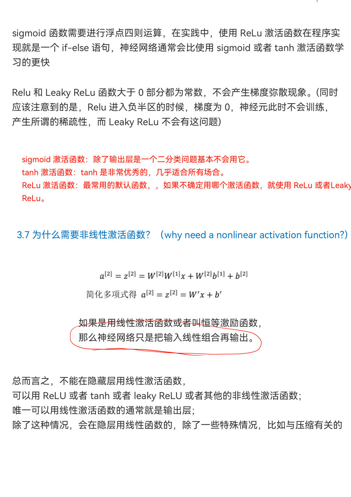

| 函数 | 公式/范围 | 使用建议 |
|---|---|---|
| sigmoid | $\sigma(z)\in(0,1)$ | 二分类输出层；深层隐藏层易饱和 |
| tanh | $\tanh(z)\in(-1,1)$ | 零中心，但仍会饱和 |
| ReLU | $\max(0,z)$ | 隐藏层默认选择，计算快 |
| Leaky ReLU | $\max(az,z)$ | 减轻“死亡 ReLU” |

若所有层都用线性激活，多层复合仍是线性函数，因此隐藏层需要非线性。

### 反向传播

二分类输出层：

$$
dZ^{[2]}=A^{[2]}-Y
$$

$$
dW^{[2]}=\frac1m dZ^{[2]}(A^{[1]})^T,\quad
db^{[2]}=\frac1m\sum dZ^{[2]}
$$

$$
dZ^{[1]}=(W^{[2]})^TdZ^{[2]}\odot g'^{[1]}(Z^{[1]})
$$

所有权重不能同时初始化为 0，否则隐藏单元始终对称。使用小随机数或与扇入匹配的初始化。

---

## 第 4 周：深层神经网络（p.15–21）

### 深层前向与反向传播

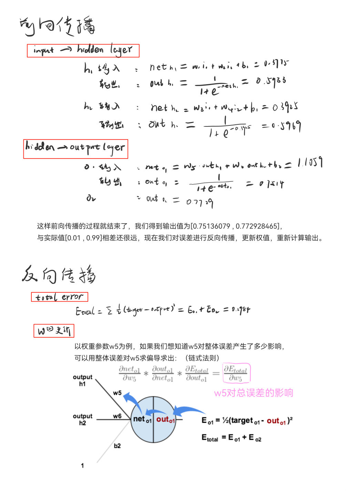

$$
Z^{[l]}=W^{[l]}A^{[l-1]}+b^{[l]},\quad
A^{[l]}=g^{[l]}(Z^{[l]})
$$

前向时缓存 $A^{[l-1]},W^{[l]},b^{[l]},Z^{[l]}$；反向时逐层计算：

$$
dW^{[l]}=\frac1m dZ^{[l]}(A^{[l-1]})^T,quad
db^{[l]}=\frac1m\sum dZ^{[l]}
$$

$$
dA^{[l-1]}=(W^{[l]})^TdZ^{[l]}
$$

### 深层表示为何有效

深层网络通过层级组合复用特征：图像中可从边缘到纹理、部件再到对象；语音中可从短时频谱到音素、词和语义。电路复杂度观点也说明，有些函数用浅层网络表示需要指数级单元，而深层组合更紧凑。

### 参数与超参数

- **参数**：$W,b$，由训练学习。
- **超参数**：学习率、层数、单元数、激活函数、批量大小、正则化强度、训练轮数等。

超参数控制训练过程，应以验证集表现和训练稳定性来选择。

---

# 第二门课：改善深层神经网络

## 第 1 周：深度学习的实践层面（p.22–29）

### 训练/验证/测试集

训练集用于拟合，验证集用于快速迭代与调参，测试集用于最终无偏评估。验证集与测试集应来自同一目标分布；样本极多时，验证/测试集不必固定占 20%，只需足以稳定比较模型。

### 偏差—方差诊断

以人类水平或可估计的 Bayes 误差为参照：

- 训练误差远高于可达到水平：可避免偏差大。
- 验证误差远高于训练误差：方差大。

先解决偏差还是方差取决于诊断，而非固定顺序。

### L2 正则化

$$
J_{reg}=J+\frac{\lambda}{2m}\sum_l\lVert W^{[l]}\rVert_F^2
$$

$$
dW^{[l]}\leftarrow dW^{[l]}+\frac{\lambda}{m}W^{[l]}
$$

其更新表现为权重衰减。通常不正则化偏置。

### Dropout

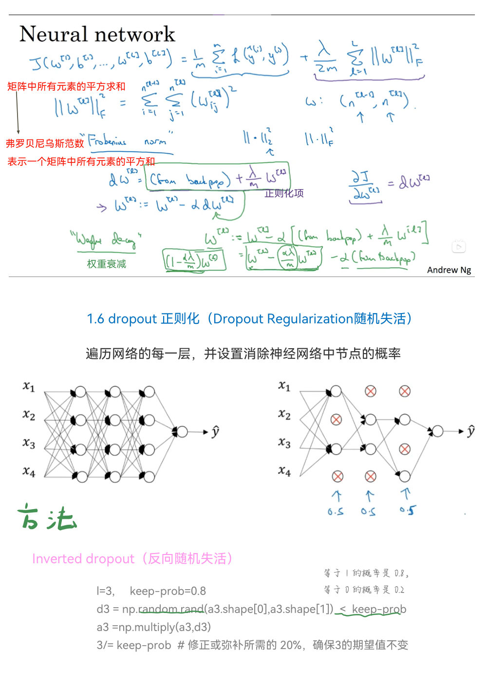

训练时为每层采样掩码 $D^{[l]}$：

$$
A^{[l]}\leftarrow \frac{A^{[l]}\odot D^{[l]}}{keep\_prob}
$$

这是 inverted dropout，使测试时无需再次缩放。测试/推理阶段必须关闭 dropout。它能减少特征间脆弱的共适应，但会令每步代价随机，调试时可先关闭以检查 $J$ 是否下降。

### 其他正则化

- 数据增强：产生符合真实不变性的样本。
- Early stopping：验证指标不再提升时停止；简单但将优化与正则化耦合。
- 权重衰减、标签平滑、随机深度等可按任务选择。

### 输入归一化

$$
x\leftarrow\frac{x-\mu}{\sqrt{\sigma^2+\varepsilon}}
$$

只用训练集统计量，并将同一统计量应用到验证集、测试集和线上输入。

### 梯度消失/爆炸与初始化

深层反向传播包含许多 Jacobian 连乘，范数持续小于 1 会消失，大于 1 会爆炸。

- Xavier（适合 tanh）：$\operatorname{Var}(W)\approx1/n_{in}$。
- He（适合 ReLU）：$\operatorname{Var}(W)\approx2/n_{in}$。
- 还可使用归一化层、残差连接和梯度裁剪。

### 梯度检验

把所有参数展开为向量，用中心差分计算数值梯度，再比较：

$$
\frac{\lVert g_{approx}-g\rVert_2}{\lVert g_{approx}\rVert_2+\lVert g\rVert_2}
$$

检查时关闭 dropout；不要在正式训练中持续运行；若含正则化，解析和数值目标必须一致。

---

## 第 2 周：优化算法（p.30–38）

### Mini-batch 梯度下降

每轮（epoch）遍历全部训练集，每个 mini-batch 更新一次参数。批量大小常取 2 的幂以利硬件利用，但最终由吞吐、显存和验证效果决定。

- batch 太大：单步稳定但更新少、内存高。
- batch 太小：噪声大但更新频繁，可能有正则化效果。

### 指数加权平均

$$
v_t=\beta v_{t-1}+(1-\beta)\theta_t
$$

有效窗口约为 $1/(1-\beta)$。初期偏差修正：

$$
\hat v_t=\frac{v_t}{1-\beta^t}
$$

### Momentum

$$
v_{dW}=\beta v_{dW}+(1-\beta)dW,qquad W\leftarrow W-\alpha v_{dW}
$$

它抑制高曲率方向的来回摆动，并沿一致方向积累速度。

### RMSprop

$$
s_{dW}=\beta_2s_{dW}+(1-\beta_2)dW^2
$$

$$
W\leftarrow W-\alpha\frac{dW}{\sqrt{s_{dW}}+\varepsilon}
$$

### Adam

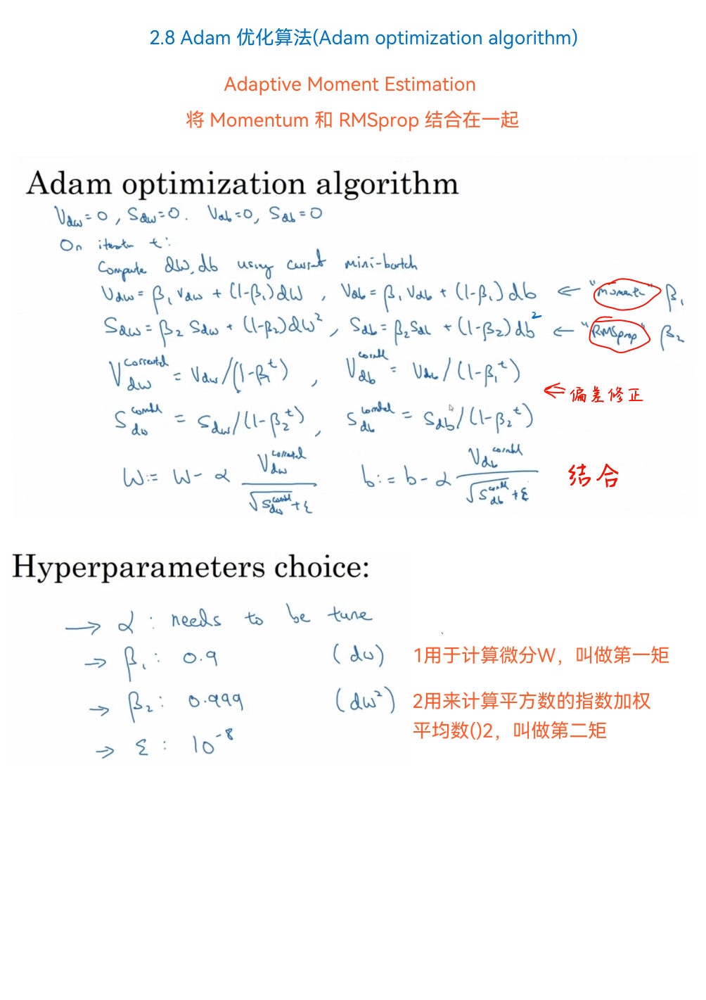

Adam 结合一阶矩（Momentum）和二阶矩（RMSprop），并做偏差修正：

$$
W\leftarrow W-\alpha\frac{\hat v_{dW}}{\sqrt{\hat s_{dW}}+\varepsilon}
$$

常见初值：$\beta_1=0.9,\beta_2=0.999,\varepsilon=10^{-8}$，学习率仍需调节。

### 学习率衰减与局部几何

可使用阶梯、指数、余弦或基于验证指标的衰减。高维非凸目标的零梯度点往往是鞍点而非差的局部极小；更常见的困难是长时间停留在平坦区。动量、归一化和合理初始化有助于通过平坦区。

---

## 第 3 周：超参数、BatchNorm 与框架（p.39–47）

### 超参数搜索

优先级通常为：学习率最高，其次是动量/批量大小/隐藏单元，再到层数和学习率衰减。随机搜索比规则网格更容易覆盖重要维度；对学习率、正则化等跨数量级参数应在对数尺度采样。

两种工作方式：

- **Pandas**：同时训练许多模型，适合计算资源充足。
- **Caviar**：维护并持续调试一个模型，适合单次训练昂贵。

### Batch Normalization

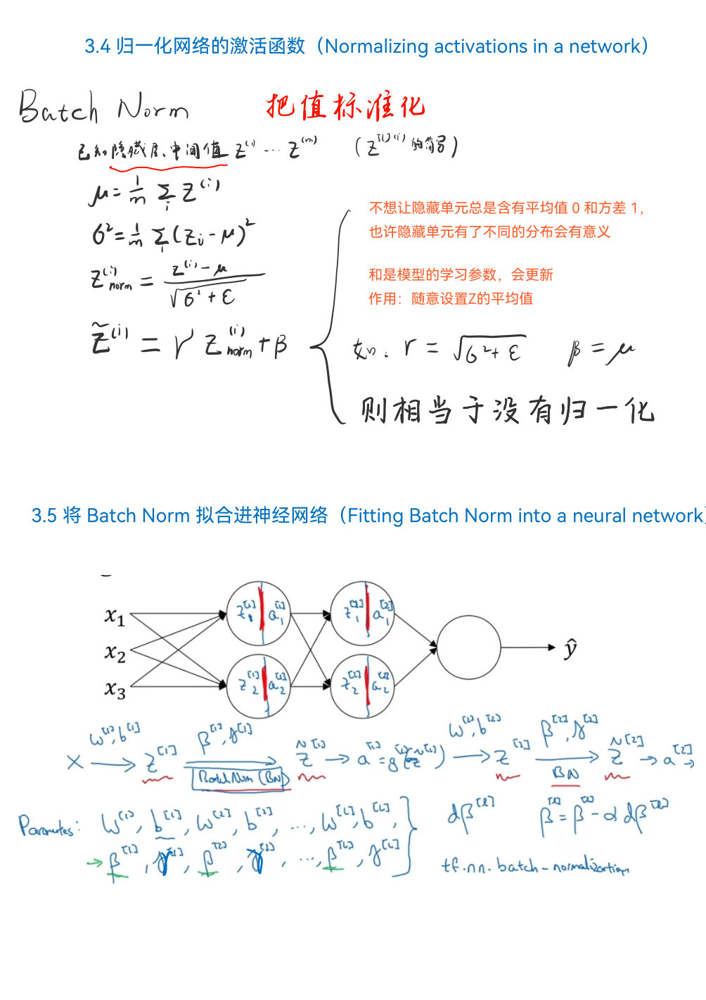

对 mini-batch 中某层的 $z$：

$$
\mu_B=\frac1m\sum_i z_i,\qquad
\sigma_B^2=\frac1m\sum_i(z_i-\mu_B)^2
$$

$$
\hat z_i=\frac{z_i-\mu_B}{\sqrt{\sigma_B^2+\varepsilon}},\qquad
\tilde z_i=\gamma\hat z_i+\beta
$$

$\gamma,\beta$ 可学习，因此标准化后仍能恢复合适的均值和尺度。训练时使用批次统计量，推理时使用移动平均统计量；两种模式切换错误是常见故障。

### Softmax

$$
p_k=\frac{e^{z_k}}{\sum_j e^{z_j}},\qquad
\mathcal L=-\sum_k y_k\log p_k
$$

为数值稳定，先从所有 logits 减去最大值。多分类互斥标签用 softmax；多个标签可同时为真时，用逐类 sigmoid。

### 框架选择

关注开发效率、生态、部署环境、自动微分和硬件支持。无论框架如何，始终检查张量形状、训练/推理模式、随机种子、数据预处理和保存/加载是否一致。

---

# 第三门课：结构化机器学习项目

## 第 1 周：机器学习策略（一）（p.48–52）

### 正交化

为每个问题选择针对性旋钮：

- 训练集拟合差：增大模型、改善优化。
- 验证集泛化差：正则化、增加训练数据。
- 测试集与验证集差异大：增加验证集或减少对验证集过拟合。
- 线上体验差：重新设计指标/数据分布。

Early stopping 同时影响优化与泛化，因此不是很“正交”的控制手段。

### 单一评估指标

开发时需要快速排序模型，可将多个指标组合为一个优化指标，并把其他要求设为满足指标。例如最大化准确率，同时要求延迟低于 100 ms。

### 数据集分布与大小

验证集和测试集必须反映未来真正关心的分布，并从同一分布抽样。测试集大小取决于希望多精确地估计最终性能；若无需最终无偏报告，可以只有训练集和验证集，但应明确风险。

### 何时修改指标

如果指标偏爱实际体验更差的模型，就应修改指标或样本权重。先定义正确目标，再优化模型。

### 人类水平与可避免偏差

人类水平可近似 Bayes 误差，但应选匹配任务的专家水平。可避免偏差约为“训练误差 − Bayes/人类水平”，方差约为“验证误差 − 训练误差”。

---

## 第 2 周：机器学习策略（二）（p.53–57）

### 分布不匹配

若训练数据与目标数据分布不同，可增加一个 **train-dev 集**：它来自训练分布但不参与训练。

- 训练误差 → train-dev 误差：方差。
- train-dev 误差 → dev 误差：数据不匹配。
- dev 误差 → test 误差：对验证集过拟合或抽样波动。

### 迁移学习

先在大数据源任务上预训练，再用目标任务微调。目标数据少时冻结更多底层；目标数据增多时解冻更多层。两任务输入类型相近、低层特征可共享时更有效。

### 多任务学习

一个网络同时输出多个任务，适用于任务共享低层特征、数据规模相近且模型容量足够的情况。缺失标签可通过掩码只计算已标注任务的损失。

### 端到端学习

端到端模型减少人工中间表示，可能简化系统并让数据决定特征；但它通常需要大量成对数据。若某个子任务有丰富数据或明确结构，多阶段系统可能更可靠、可诊断。

---

# 第四门课：卷积神经网络

## 第 1 周：卷积基础（p.58–68）

### 二维卷积与输出尺寸

输入 $n\times n$、卷积核 $f\times f$、padding 为 $p$、stride 为 $s$：

$$
n_{out}=\left\lfloor\frac{n+2p-f}{s}\right\rfloor+1
$$

- Valid 卷积：$p=0$。
- Same 卷积（$s=1$、奇数核）：$p=(f-1)/2$。

Padding 可减缓空间尺寸缩小并保留边缘信息。

### 多通道卷积

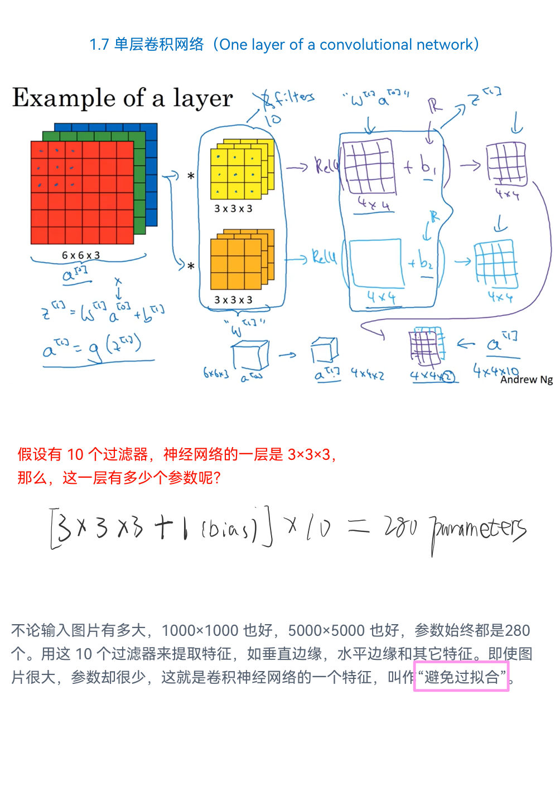

若输入通道数为 $n_C$，卷积核深度也必须为 $n_C$。一个卷积核产生一个输出通道；$n_C'$ 个核产生 $n_C'$ 个输出通道。

参数量：

$$
(f\times f\times n_C+1)\times n_C'
$$

与输入图像宽高无关，这来自参数共享和稀疏连接。

### 池化

最大池化提供局部平移鲁棒性，通常无可学习参数；平均池化常用于网络末端的全局聚合。池化也会损失空间信息，现代结构有时用带步长卷积替代。

### 典型 CNN

常见流程：`Conv → BN → ReLU → Pool/Stride` 重复若干次，再接全局池化/全连接输出。卷积层提取局部特征，全连接或全局池化负责映射到任务输出。

---

## 第 2 周：经典网络、ResNet 与 Inception（p.69–77）

### 经典网络

- LeNet：早期手写数字识别。
- AlexNet：ReLU、GPU 和大规模视觉数据推动深度 CNN。
- VGG：反复堆叠 $3\times3$ 卷积，结构规则但计算大。

### ResNet

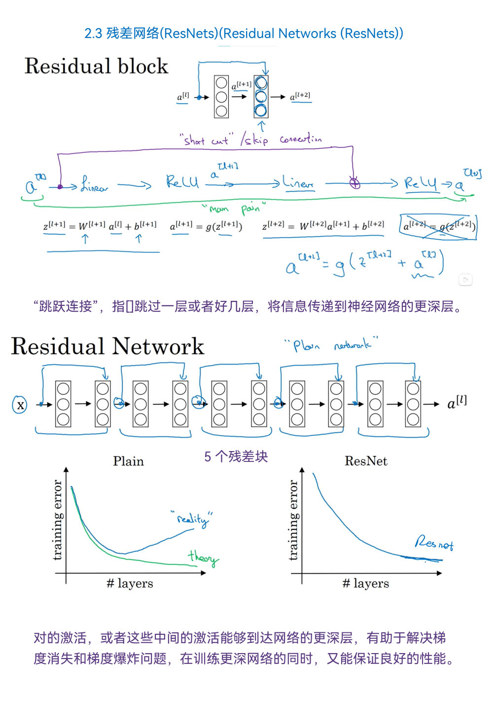

残差块：

$$
a^{[l+2]}=g(F(a^{[l]})+a^{[l]})
$$

捷径连接为梯度和信息提供短路径。若维度不同，可用 $1\times1$ 卷积投影捷径。残差分支很容易学习到零，使加深网络至少能近似恒等映射。

### $1\times1$ 卷积

在每个空间位置对通道做共享的线性组合并配合非线性，可改变通道数、降低计算量和增加表达能力。

### Inception

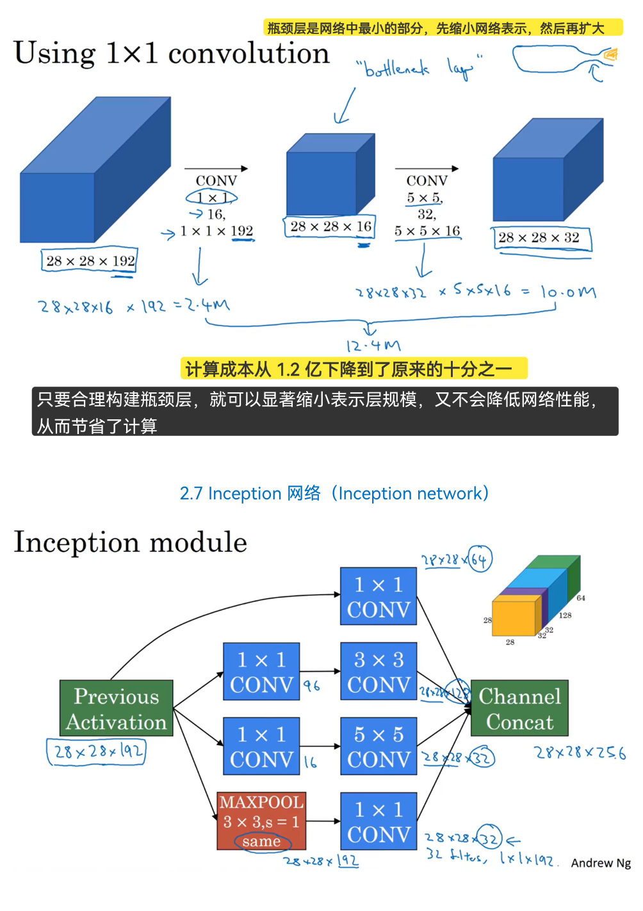

并行使用不同尺度卷积和池化，再沿通道拼接，让网络自行选择尺度。先用 $1\times1$ 瓶颈降维，再做昂贵卷积，可显著降低计算量。

### 迁移学习与增强

小数据集可加载预训练网络，先冻结骨干并训练新头部，再用较小学习率微调。增强应保留标签语义：随机裁剪、翻转、颜色扰动等；不要引入线上不会出现的失真。

---

## 第 3 周：目标检测（p.78–84）

### 定位与检测

目标定位同时预测类别和边界框，可表示为 $(p_c,b_x,b_y,b_w,b_h,c_1,\ldots,c_K)$。多目标检测需要在不同网格/候选框上重复此预测。

### 滑动窗口的卷积实现

把全连接层改写为卷积层，可让重叠窗口共享计算，但窗口位置较粗时边界不够精确。YOLO 直接回归边界框，避免逐窗口运行网络。

### IoU

$$
IoU=\frac{\text{预测框与真实框交集面积}}{\text{两框并集面积}}
$$

IoU 用于匹配预测和真值，也用于 NMS 的重叠判定；阈值取决于任务与评估规范。

### 非极大值抑制（NMS）

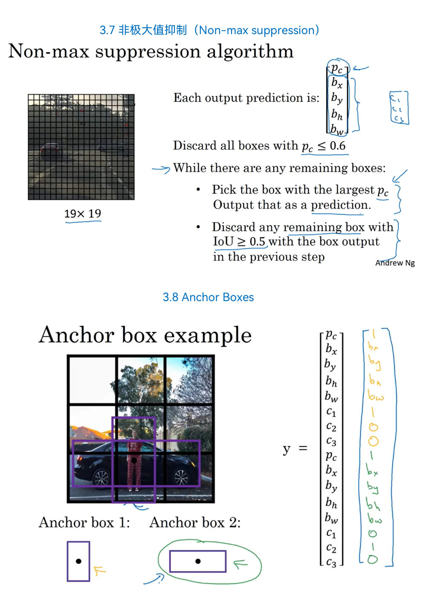

1. 丢弃低置信度框。
2. 选剩余框中得分最高者。
3. 删除与它 IoU 过高的同类框。
4. 重复直至处理完。

应按类别执行；Soft-NMS 会衰减分数而非直接删除。

### Anchor Boxes 与 YOLO

每个网格预测多个 anchor，使同一位置可表示不同宽高比/多个对象。训练时把目标分配给形状最匹配的 anchor。YOLO 输出经解码、置信度过滤和 NMS 得到最终检测框。

### 候选区域方法

R-CNN 系列先提出候选区域再分类/回归；Faster R-CNN 用 RPN 学习候选区域，通常精度高但推理链路比单阶段检测器复杂。

---

## 第 4 周：人脸识别与神经风格迁移（p.85–90）

### 人脸验证与识别

- 验证：两张脸是否属于同一人（1:1）。
- 识别：输入脸属于数据库中的谁（1:N）。

One-shot 场景每人可能只有一张注册照片，因此学习“相似度/嵌入”比直接训练固定人员分类器更合适。

### Siamese 网络

共享参数的网络把图像映射到嵌入 $f(x)$，同一人的距离小、不同人的距离大。共享权重确保两个输入使用同一特征空间。

### Triplet Loss

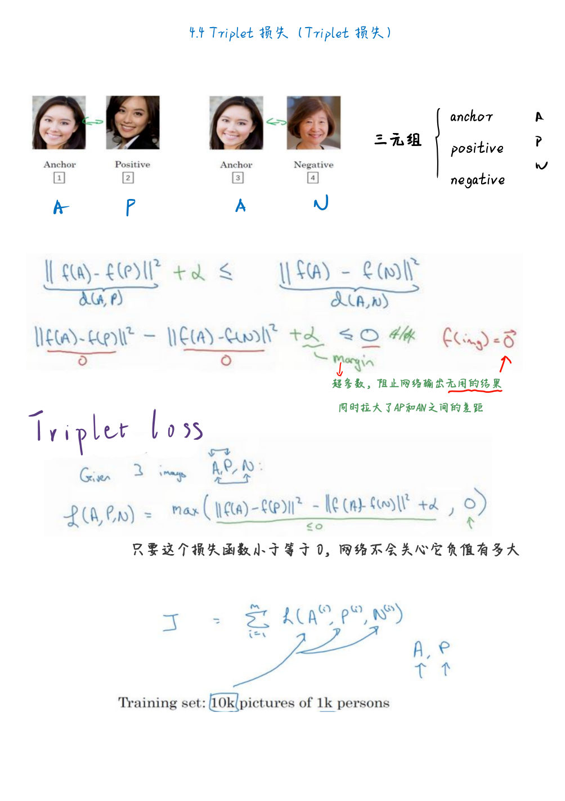

锚点 $A$、正样本 $P$、负样本 $N$：

$$
\mathcal L=\max\left(\lVert f(A)-f(P)\rVert_2^2-
\lVert f(A)-f(N)\rVert_2^2+\alpha,0\right)
$$

随机负样本太容易会导致损失为 0；应进行 hard/semi-hard negative mining，同时避免错误标签造成的“假负样本”。

### 二分类式验证

也可将两个嵌入的差异输入逻辑回归，输出是否同一人。注册库嵌入可预计算，线上只需计算查询嵌入和距离。

### 神经风格迁移

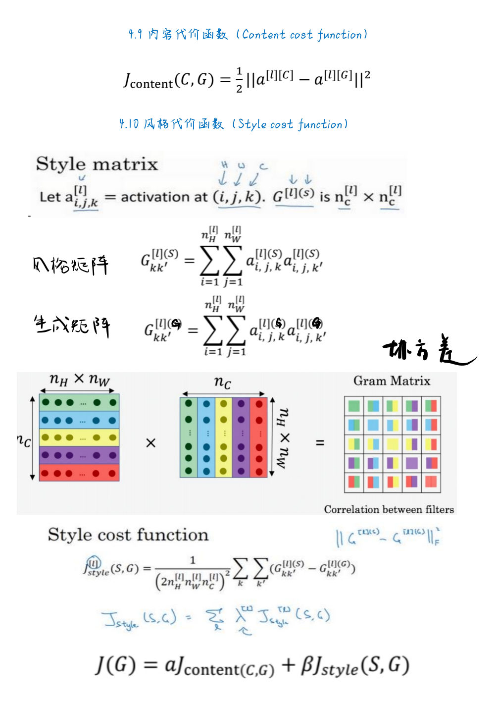

优化生成图像 $G$，同时匹配内容图 $C$ 的高层激活和风格图 $S$ 的通道相关性：

$$
J(G)=\alpha J_{content}(C,G)+\beta J_{style}(S,G)
$$

内容损失常比较某层激活：

$$
J_{content}=\lVert a^{[l]}(C)-a^{[l]}(G)\rVert_F^2
$$

风格用 Gram 矩阵 $G^{[l]}=A^{[l]}(A^{[l]})^T$ 表示通道相关性，并在多层累加差异。优化变量是图像像素，而网络参数保持冻结。

卷积思想也可推广到 1D 序列和 3D 体数据，只需相应改变卷积核与空间维度。

---

# 公式与排错速查

## 常见输出层

| 任务 | 输出 | 损失 |
|---|---|---|
| 回归 | 线性 | MSE/MAE |
| 二分类 | 1 个 logit + sigmoid | 二元交叉熵 |
| 互斥多分类 | $K$ 个 logits + softmax | 多类交叉熵 |
| 多标签 | $K$ 个独立 sigmoid | 逐类二元交叉熵 |

## 训练异常排查

### 损失不下降

1. 先让模型在极小数据集上过拟合，验证代码链路。
2. 检查标签、损失和输出层是否匹配。
3. 检查学习率、梯度是否为 0/NaN、参数是否真正参与优化。
4. 关闭 dropout/增强，确认基础目标可学习。
5. 检查归一化和数据类型。

### 训练好、验证差

检查数据泄漏和分布划分，再考虑增加数据、增强、正则化、减小模型或 early stopping。

### 训练/推理结果不一致

检查 `train/eval` 模式、BatchNorm 移动统计量、dropout、预处理、类别映射和随机性。

### 出现 NaN/Inf

降低学习率、检查除零和对数输入、使用稳定损失、做梯度裁剪，并定位首次出现非有限值的层。

## 复习清单

- [ ] 能写出逻辑回归和多层网络的向量化前向/反向传播。
- [ ] 能解释 ReLU、初始化、BatchNorm 和残差连接对梯度传播的影响。
- [ ] 能比较 L2、dropout、数据增强与 early stopping。
- [ ] 能写出 Momentum、RMSprop、Adam 的核心更新。
- [ ] 能用偏差、方差和数据不匹配拆解模型问题。
- [ ] 能计算卷积输出尺寸和参数量。
- [ ] 能解释 IoU、NMS、anchor 与 YOLO 的关系。
- [ ] 能说明 Siamese、Triplet Loss 和风格迁移的目标。
